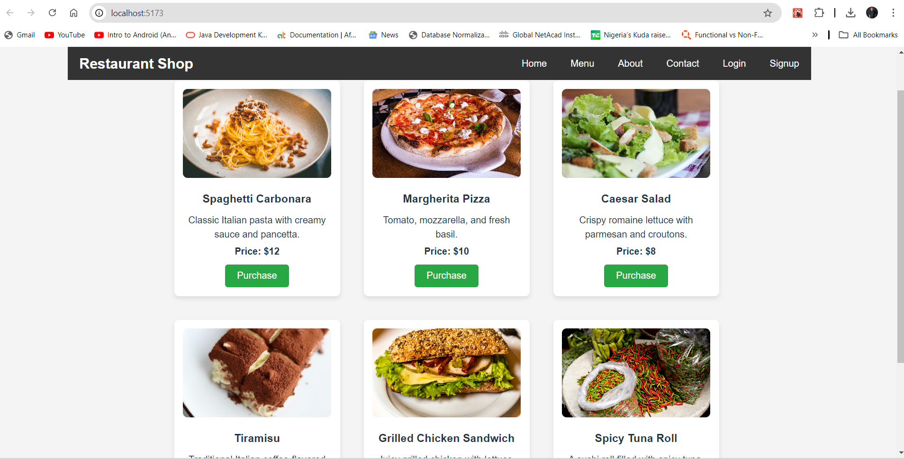
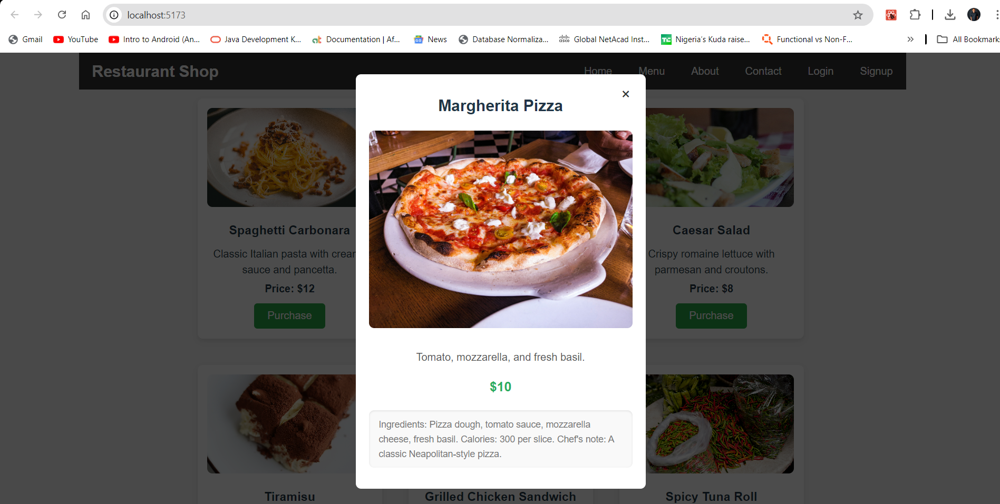
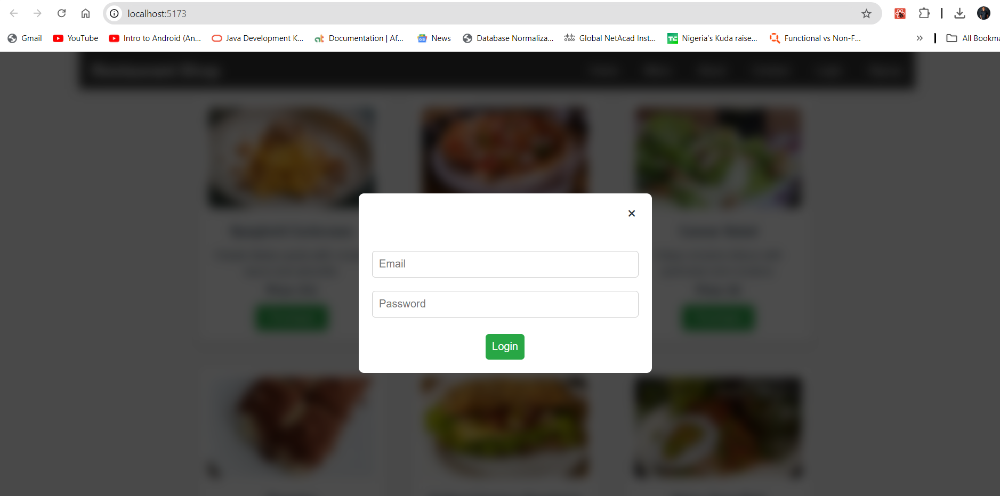
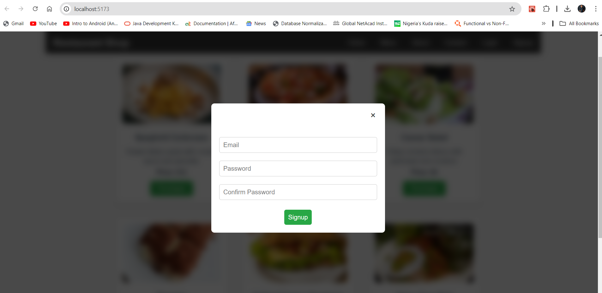

## Restaurant Shop - Frontend
This project is the frontend for a restaurant shop application built using React. The application allows users to browse food items, view detailed information in a modal, and provides login/signup functionality.

### Table of Contents
- `Features`
- `Tech Stack`
- `Project Structure`
- `Setup Instructions`
- `Available Scripts`
- `Component Overview`
- `Styling`
- `Future Improvements`
- `Contributing`
- `License`

### Features
- Display food items in a card-based layout.
- View detailed information about a food item in a modal with a blurred background.
- Fixed navbar that remains visible while scrolling.
- Responsive design with modals for login and signup.
- Separate modals for login and signup with centered  positioning and green action buttons.

### Tech Stack
- `React:` UI Library for building the frontend.
- `TypeScript:` Typed JavaScript for safer and more scalable code.
- `CSS:` Custom styles for layout and component design.
- `Vite:` Development environment and build tool for fast performance.

### Setup Instructions
#### Prerequisites
Ensure you have the following installed:

- Node.js (v14 or later)
- npm or yarn
- Installation

#### Clone the repository:


```bash
git clone https://github.com/chinemeze847/Resto-Shop-Frontend.git
cd restaurant-shop-frontend
```
#### Install dependencies:
```bash
npm install
```
### Running the Application
```bash
npm run dev
```

### Component Overview
- `Navbar`
The Navbar is a fixed component that allows navigation to different sections of the app.
It includes login and signup links that trigger modals.
- `FoodCard`
Displays individual food items with details like image, name, price, and description.
Clicking a food card fetches more details and displays them in a modal.


- `FoodItemDetails`
A modal that shows more detailed information about a selected food item.
The modal has a blurred background effect and green action buttons.

- `Modal`
Handles both login and signup forms, displayed conditionally based on user interaction.
The forms are centered and styled with proper titles like "Login With" or "Signup With".
Styling
The styling is managed using regular CSS files for each component. Key design decisions include:

## Images

### List of foods available


### More Detals of a food item


### Login Modal


### Sign up Modal


## License
This project is licensed under the MIT License.